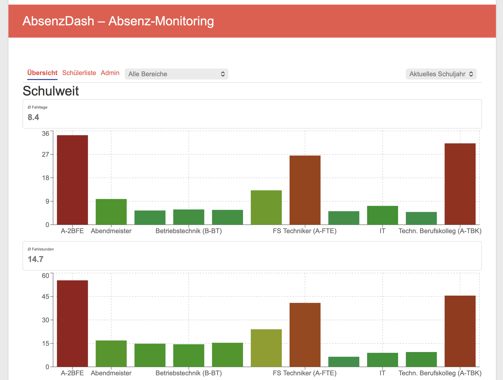

# AbsenzDash

Ein Intranet-Dashboard für Schulen: ruft Schüler-Fehlzeiten und Klassenbucheinträge aus WebUntis ab, bereitet sie für Klassenlehrkräfte, Bereichsleiter und Schulleitung auf und löst bei konfigurierbaren, mehrstufigen Schwellwerten automatische E-Mail-Benachrichtigungen aus. Protokollierte Maßnahmen (Gespräch, Elterngespräch, Nachsitzen, §90-Verfahren, Bußgeld …) können die Schwellwert-Zähler eines Schülers zurücksetzen; einzelne Schüler lassen sich befristet oder unbefristet von Benachrichtigungen ausnehmen (z. B. bei ärztlichem Attest).



Weitere Screenshots (Schülerliste, Schüler-Detail, Admin-Bereich) liegen unter [`docs/Screenshots/`](docs/Screenshots/).

## Architektur

- **Frontend:** React/TypeScript-SPA, als WordPress-Plugin verpackt und per Shortcode (`[absenzdash]`) in eine bestehende WordPress-Instanz im Schulintranet eingebunden. Enthält auch den Admin-Bereich für die fachliche Konfiguration (Schwellwerte, Maßnahmen-Katalog, Sync-Intervall).
- **Backend:** Eigener API-Server (Python/FastAPI) im Schul-Intranet — nicht öffentlich aus dem Internet erreichbar.
- **Datenbank:** PostgreSQL — Cache für WebUntis-Daten (Fehlzeiten, Klassenbucheinträge), Bereichsdefinition, Schwellwert-Konfiguration, Maßnahmen, Ausnahmen, Audit-Log.
- **Auth:** WordPress-Benutzerverwaltung (lokal oder LDAP/AD-Anbindung). Ein generischer Reverse-Proxy im WordPress-Plugin reicht Requests mit vertrauenswürdigen Headern (Rolle, Zuständigkeitsbereich) an das Backend weiter, abgesichert über ein gemeinsames Secret.
- **WebUntis-Anbindung:** Ein zentraler WebUntis-Service-Account synchronisiert Fehlzeiten und Klassenbucheinträge für die gesamte Schule in konfigurierbarem Intervall (APScheduler-Cron).
- **Schüler-Stammdaten:** Import aus einem ASV-BW-CSV-Export (nicht aus WebUntis selbst, siehe [TECH-SPEC.md](TECH-SPEC.md) Abschnitt 1.3).

Details zum Datenmodell, API-Vertrag und WebUntis-Feldmapping: [TECH-SPEC.md](TECH-SPEC.md). Fachliche Spezifikation: [SPECS.md](SPECS.md).

## Features

- Fehlzeiten-Erfassung: Fehltage/Fehlstunden inkl. Entschuldigt/Unentschuldigt-Split, Fehlstunden minutengenau (nicht pauschal pro Stunde)
- Mehrstufige, konfigurierbare Schwellwert-Regeln (schulweit/abteilungsweit/klassenweit) mit automatischem E-Mail-Versand bei neu erreichter Stufe
- Maßnahmen-Katalog mit konfigurierbarem Zähler-Reset
- Befristete/unbefristete Ausnahmen von Benachrichtigungen
- Sortierbare, farbcodierte Schülerliste mit Eskalationsstufen-Badges
- Schüler-Detailseite mit vollständiger Fehlzeiten-/Klassenbuch-/Maßnahmen-/Ausnahmen-/Benachrichtigungs-Historie
- PDF-Export der Schüler-Historie (für §90-/Bußgeldverfahren)
- Schuljahres-Auswahl/-Historie
- Dreistufige Rollenhierarchie: Klassenlehrkraft → Bereichsleiter → Schulleitung, mit entsprechend gestaffeltem Zugriff
- Admin-Bereich (nur Schulleitung): Schwellwert-Regeln, Maßnahmen-Katalog, Entschuldigungsstatus, Sync-Einstellungen

## Voraussetzungen

- **Docker** für das Backend (Python 3.11 läuft ausschließlich containerisiert — lokal muss kein Python installiert sein)
- **Node.js** ≥ 22.12 (getestet mit v26) + npm für den Frontend-Build — seit dem Vite-8-/Vitest-5-Upgrade reicht Node 18 nicht mehr aus (siehe [docs/deployment.md](docs/deployment.md))
- Eine bestehende **WordPress-Instanz** (≥ 5.6, PHP ≥ 7.4) mit Volume-Mount-Möglichkeit für Plugin-Verzeichnisse
- **WebUntis-Service-Account**-Zugangsdaten
- Ein lesbar gemountetes Verzeichnis mit dem aktuellen **ASV-BW-CSV-Export** (Schüler-Stammdaten)
- SMTP-Zugang für den E-Mail-Versand

## Quick Start

```bash
# Backend
cp backend/.env.example backend/.env   # echte Werte eintragen (WebUntis, SMTP, Secret, ...)
docker compose -f backend/docker-compose.yml up -d --build
docker compose -f backend/docker-compose.yml run --rm backend alembic upgrade head

# Frontend (baut direkt nach wordpress-plugin/absenzdash/assets/spa/)
cd frontend
npm install
npm run build
```

Danach das Plugin-Verzeichnis `wordpress-plugin/absenzdash/` per Volume-Mount in eine WordPress-Instanz einbinden, dort aktivieren, Backend-URL/Secret unter **Einstellungen → AbsenzDash** eintragen und eine Seite mit dem Shortcode `[absenzdash]` anlegen.

Ausführliche Setup-Schritte (inkl. lokaler Entwicklung mit Hot-Module-Reload, Rollen-/Bereichszuweisung, Netzwerk-Konfiguration): [docs/deployment.md](docs/deployment.md) und [docs/backend-setup.md](docs/backend-setup.md).

## Tests

```bash
# Backend (benötigt laufende PostgreSQL-Instanz)
docker compose -f backend/docker-compose.yml up -d postgres
docker compose -f backend/docker-compose.yml run --rm backend pytest

# Frontend
cd frontend && npm test
```

Details zur CI/CD-Pipeline: [docs/ci-cd-setup.md](docs/ci-cd-setup.md).

## Tech-Stack

| | |
|---|---|
| Backend | Python 3.11, FastAPI, SQLAlchemy (async), PostgreSQL, Alembic, APScheduler, WeasyPrint |
| Frontend | React, TypeScript, Vite, TanStack Query, react-router |
| Integration | WordPress-Plugin (PHP), WebUntis JSON-RPC |

## Dokumentation

- [SPECS.md](SPECS.md) — fachliche Spezifikation
- [TECH-SPEC.md](TECH-SPEC.md) — Datenmodell, API-Vertrag, WebUntis-Feldmapping
- [ROADMAP.md](ROADMAP.md) — Fortschritts-Tracker, was ist umgesetzt, was ist offen
- [docs/backend-setup.md](docs/backend-setup.md) — Backend-Setup im Detail
- [docs/deployment.md](docs/deployment.md) — Deployment & lokale Entwicklung (Backend, Frontend, WordPress-Plugin)
- [docs/ci-cd-setup.md](docs/ci-cd-setup.md) — CI/CD-Pipeline
- Nutzer-Handreichungen: [docs/KL.md](docs/KL.md) (Klassenlehrkraft), [docs/BL.md](docs/BL.md) (Bereichsleitung), [docs/SL.md](docs/SL.md) (Schulleitung), [docs/ADMIN.md](docs/ADMIN.md) (IT-Administrator)

## Status

Backend, Frontend und WordPress-Plugin sind funktional vollständig (siehe [ROADMAP.md](ROADMAP.md) für den detaillierten Fortschritts-Tracker und offene Punkte). Referenzprojekt und Architekturvorbild: [VertretungsFlow](https://github.com/digitale-Schulverwaltung-BW/VertretungsFlow) (Lehrer-Vertretungsplanung, gleiche Schule).

## Lizenz

MIT, siehe [LICENSE](LICENSE).
