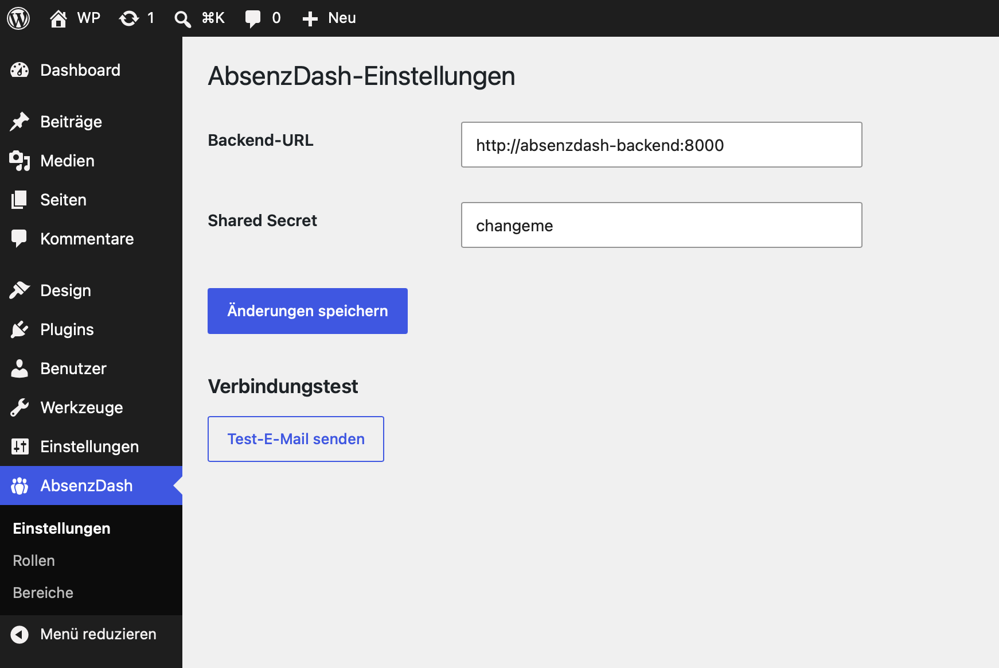

# AbsenzDash für Administratoren

Diese Anleitung richtet sich an IT-erfahrene Administratoren, die AbsenzDash technisch betreiben (Deployment, Server-Konfiguration, WebUntis-/SMTP-Anbindung, Troubleshooting). Für die fachliche Konfiguration (Schwellwerte, Maßnahmen-Katalog, Rollen-Zuweisung, Bereichsdefinition) siehe [SL.md](SL.md) — diese Aufgaben liegen bei der Schulleitung, nicht bei der IT.

## Architekturüberblick

- **Frontend:** React/TypeScript-SPA, ausgeliefert als WordPress-Plugin (`wordpress-plugin/absenzdash/`), per Shortcode `[absenzdash]` in eine bestehende WP-Seite eingebunden.
- **Backend:** eigenständiger FastAPI-Server im Schul-Intranet (`backend/`), **ohne** Internet-Zugriff erreichbar.
- **Datenbank:** PostgreSQL.
- **Auth:** läuft vollständig über WordPress (lokal oder LDAP/AD); das Backend selbst hat keine eigene Nutzerverwaltung. WordPress und Backend kommunizieren über ein gemeinsames Secret (`WORDPRESS_PROXY_SECRET`).
- **WebUntis-Anbindung:** ein zentraler WebUntis-Service-Account, periodischer Sync-Job im Backend (APScheduler).
- **Referenzarchitektur:** analog zum Schwesterprojekt [VertretungsFlow](https://github.com/digitale-Schulverwaltung-BW/VertretungsFlow) (gleiche Schule).

Details zu Datenmodell und API-Vertrag: [TECH-SPEC.md](../TECH-SPEC.md). Fachlicher Gesamtüberblick: [SPECS.md](../SPECS.md).

## Setup & Deployment

Die vollständige technische Anleitung (Backend per Docker Compose, Datenbank-Migrationen, WordPress-Plugin-Einbindung, Frontend-Build, Netzwerk-Konfiguration) steht in:

- [backend-setup.md](backend-setup.md) — Backend-Voraussetzungen, Setup, Tests, Migrationen, Aktueller Stand
- [deployment.md](deployment.md) — Deployment/lokale Entwicklung für Backend, WordPress-Plugin und Frontend, inkl. Netzwerk-Konfiguration (`absenzflow-shared`-Docker-Netzwerk)
- [ci-cd-setup.md](ci-cd-setup.md) — Test-Pipeline (GitLab CI/CD)

Kurzfassung des Ablaufs bei einer Neuinstallation:

1. Backend: `.env` aus `.env.example` befüllen (siehe unten), `docker compose up -d --build`, dann `alembic upgrade head`.
2. WordPress: Plugin-Verzeichnis mounten, Plugin aktivieren, Permalink-Struktur auf nicht-"Einfach" stellen.
3. Backend-URL und Shared Secret im WP-Backend eintragen (siehe unten).
4. Rollen-Zuweisung & Bereichsdefinition — organisatorisch, wird von der Schulleitung gepflegt (siehe [SL.md](SL.md)), technische Voraussetzung ist nur eine funktionierende Backend-Verbindung.
5. Frontend bauen (`npm run build` in `frontend/`), Shortcode-Seite anlegen, aufrufen und prüfen, dass das Dashboard erscheint.

## WordPress-Plugin-Verbindung



Unter **Einstellungen → AbsenzDash** im WP-Backend:

- **Backend-URL** — z.B. `http://absenzdash-backend:8000`, erreichbar über das gemeinsame Docker-Netzwerk `absenzflow-shared`.
- **Shared Secret** — muss exakt `WORDPRESS_PROXY_SECRET` aus `backend/.env` entsprechen. Ohne korrektes Secret schlägt jede Anfrage vom Plugin ans Backend fehl.
- **Test-E-Mail senden** — verschickt eine Test-Mail an die Adresse des eingeloggten WP-Nutzers und prüft damit direkt die SMTP-Konfiguration (`SMTP_*` in `backend/.env`), unabhängig von der eigentlichen Eskalations-Engine. Guter erster Schritt bei Problemen mit E-Mail-Benachrichtigungen.

**Kein Self-Lockout:** WP-Administratoren (`manage_options`) werden vom Proxy für alle `/admin/*`-Aufrufe automatisch als `schulleitung` erkannt, unabhängig von der tatsächlich zugewiesenen AbsenzDash-Rolle. Für den eigentlichen Dashboard-Zugriff (Shortcode-SPA) ist dagegen immer eine echte Rollenzuweisung nötig (siehe [SL.md](SL.md)) — ohne sie liefert der Proxy HTTP 400 ("Keine Rolle zugewiesen").

## WebUntis-Sync — technische Seite

Der Sync-Ablauf (Klassen/Kategorien → ASV-BW-CSV-Import → Fehlzeiten/Klassenbuch, orchestriert in `app/services/sync_orchestrator.py`) läuft automatisch nach dem in den Sync-Einstellungen konfigurierten Intervall (siehe [SL.md](SL.md) für die fachliche Konfigurationsoberfläche). Als IT-Administrator verantworten Sie die zugrundeliegende Infrastruktur:

- **WebUntis-Zugangsdaten:** `WEBUNTIS_SERVER`/`_SCHOOL`/`_USERNAME`/`_PASSWORD` in `backend/.env`.
- **ASV-BW-CSV-Import:** `ASV_CSV_PATH` muss auf ein live gemountetes Verzeichnis zeigen, in das ein externes System die aktuelle Export-Datei unter festem Dateinamen ablegt. Spaltennamen sind über `ASV_CSV_COLUMN_*`-Env-Vars anpassbar, falls sie von der Referenzschule abweichen. Unveränderte Dateien (per mtime-Vergleich) werden übersprungen.
- **ASV-Import unabhängig von WebUntis:** Der ASV-CSV-Import (und damit die Pflege von `schueler.aktiv` anhand von Ein-/Austrittsdatum) läuft in jedem Sync-Lauf **auch dann**, wenn ein vorheriger WebUntis-Schritt fehlschlägt (Login/Verbindung, Klassen-Sync o.ä.) — der Lauf gilt danach weiterhin als fehlgeschlagen und wird wie oben wiederholt. Ein WebUntis-Ausfall lässt ausgeschiedene Schüler also nicht mehr im aktuellen Schuljahr stehen. Im Log erscheint dazu die Zeile `WebUntis-Teil des Sync-Laufs fehlgeschlagen ... ASV-CSV-Import läuft trotzdem weiter`.
- **Aus der ASV-CSV verschwundene Schüler:** Ein bereits bekannter Schüler, dessen `externe_id` in der aktuellen ASV-Export-Datei gar nicht mehr vorkommt (z.B. in ASV-BW in eine organisatorische "Papierkorb"-Klasse verschoben, ohne Austrittsdatum, und danach nicht mehr exportiert), wird beim nächsten Import automatisch auf `aktiv = false` gesetzt (Log: `nicht mehr in der Datei enthalten, als inaktiv markiert`). Klasse und Name bleiben als letzter bekannter Stand erhalten; erscheint der Schüler später wieder in der Datei, wird `aktiv` regulär neu aus Ein-/Austrittsdatum berechnet. Zeilen, die nur wegen eines fehlerhaften Datums übersprungen werden, zählen dabei weiterhin als "in der Datei enthalten".
- **Retry-Verhalten:** schlägt ein Sync-Lauf fehl (WebUntis nicht erreichbar, CSV nicht lesbar), wird er bis zu `WEBUNTIS_SYNC_RETRY_MAX_ATTEMPTS`-mal (Default 4) im Abstand von `WEBUNTIS_SYNC_RETRY_DELAY_MINUTES` (Default 30) erneut versucht, bevor er endgültig abbricht und geloggt wird.
- **Manueller Einzel-Sync:** `POST /admin/sync-now` (bzw. der Button "Sync jetzt ausführen" im Dashboard, siehe [SL.md](SL.md)) läuft **synchron im Request ohne den obigen Retry-Loop** und kann mehrere Minuten dauern — Timeouts eines vorgelagerten Reverse-Proxys in Produktion entsprechend großzügig setzen.

## E-Mail-Versand

- Pflichtangaben in `backend/.env`: `SMTP_HOST`, `SMTP_FROM_ADDRESS`, `DASHBOARD_BASE_URL` (Backend startet ohne diese nicht). Optional: `SMTP_PORT` (Default 587), `SMTP_USER`/`SMTP_PASSWORD`, `SMTP_USE_STARTTLS` (Default `true`; bei einem internen, unauthentifizierten Relay `false` setzen und `SMTP_USER` leer lassen).
- **Bekannte Einschränkung:** Schlägt der SMTP-Versand fehl, wird das im Benachrichtigungs-Log als `status="fehler"` vermerkt, aber **nicht automatisch erneut versucht** — betroffene Fälle sind im Dashboard sichtbar (siehe [KL.md](KL.md), Abschnitt "Benachrichtigungen") und müssen bei Bedarf manuell nachverfolgt werden.
- Mailinhalt anpassen: `backend/app/templates/email_benachrichtigung.txt.default` ist die versionierte Default-Vorlage; für schulspezifische Anpassungen `backend/app/templates/email_benachrichtigung.txt` anlegen (nicht versioniert, wirkt ohne Neustart).

## Monitoring & Troubleshooting

- **Health-Check:** `GET /health` am Backend.
- **Migrationen:** nach jedem Update `docker compose run --rm backend alembic upgrade head` ausführen (siehe [backend-setup.md](backend-setup.md)). Das Backend prüft beim Start selbst, ob die DB auf der vom Code erwarteten Alembic-Revision steht, und schreibt bei Abweichung eine `WARNING`-Zeile ins Log (`app/core/migration_check.py`) — wendet die Migration aber bewusst **nicht automatisch** an, da manche Migrationen einen manuellen Vorbereitungsschritt brauchen (z.B. der `TRUNCATE fehlzeit`-Reset, siehe [deployment.md](deployment.md)), der dabei sonst unbemerkt übergangen würde.
- **Tests:** `docker compose run --rm backend pytest` (Backend), siehe [ci-cd-setup.md](ci-cd-setup.md) für die CI-Pipeline und häufige lokale Fehlerquellen (z.B. "database connection refused").
- **Veraltete Eskalationsstufe im Dashboard (Klasse ohne Regel):** `pruefe_schwellwerte` überspringt Schüler mit aktiver Ausnahme oder ohne auflösbare Regel (z.B. Fehlzeiten-Regel nur für eine Abteilung gesetzt). Früher blieb dabei der gespeicherte `schueler_zaehlerstand` (Stufe/Stand, z.B. aus dem Vorjahr) unverändert stehen; jetzt wird ein bestehender Zählerstand auf `erreichte_stufe_nr = NULL`, `aktueller_stand = 0` zurückgesetzt (ohne Benachrichtigung, ohne neue Zeile anzulegen). Pro Lauf, Klasse und Typ ohne Regel schreibt das Backend außerdem eine Log-Warnung ("Keine Regel fuer Klasse <id>, Typ <typ> aufloesbar - N Schueler ..."). Die Admin-Seite Schwellwert-Regeln zeigt dieselbe Lücke als Warnung (`GET /admin/threshold-rules/coverage`, siehe [SL.md](SL.md)).
- **Jede Klasse doppelt in den Bereichs-Vergleichen (Reparatur-Skript `scripts.repair_stale_klassen`):** Symptom nach dem Schuljahreswechsel von Plan 16 (Klassen-Historisierung): im Dashboard erscheint jede Klasse zweimal, außerdem verteilen sich Schüler auf "Geister"-Klassen. Ursache: die Migration `935e452806fd` hat beim Anlegen von `klasse.schuljahr_id` alle bestehenden Klassen dem damaligen aktuellen Schuljahr zugeordnet — das war bereits das neue Jahr, die Zeilen waren aber die Klassen des Vorjahres. WebUntis vergibt pro Schuljahr neue Klassen-IDs, der Sync legt die neuen Klassen an und löscht nie etwas, die alten Zeilen blieben als Geister im aktuellen Schuljahr stehen. Das Skript führt jede Geister-Klasse (Klasse des aktuellen Schuljahres, deren `webuntis_id` `getKlassen` für dieses Jahr nicht mehr liefert) in die gleichnamige Zeile des Vorjahres (gleiche `webuntis_id`) zusammen: `schueler.klasse_id` und `schueler_klasse_historie` werden dorthin umgehängt (Historie-Zeilen des aktuellen Schuljahres werden `NULL`, bis der nächste ASV-Import sie für aktive Schüler neu füllt), `nutzer_klasse`/`bereich_klasse` der Geister-Klasse entfallen (manuelle `nutzer_klasse`-Zuordnungen auf Geister-Klassen also ebenfalls — der Bericht weist sie aus, WebUntis-seeded Zuordnungen legt der Sync für die echten Klassen neu an). Anschließend wird `bereich_klasse` neu aufgebaut und der ASV-mtime zurückgesetzt. Geister-Klassen ohne Vorjahres-Zeile oder mit Verweis aus einer klassenbezogenen Schwellwert-Regel bleiben unangetastet und werden im Bericht zur manuellen Bearbeitung aufgelistet. Läuft ein zweites Mal ohne Wirkung (idempotent); bei leerer `getKlassen`-Antwort oder fehlendem aktuellen Schuljahr bricht es ohne Änderung ab. Empfohlener Ablauf, **während gerade kein Sync läuft**:
  1. Backup: `docker exec absenzdash-db pg_dump -U absenzdash absenzdash > absenzdash-vor-klassen-reparatur.sql`.
  2. Trockenlauf (Standard, ändert nichts): `docker compose -f backend/docker-compose.yml exec backend python -m scripts.repair_stale_klassen` — Bericht prüfen (eine Zeile `id / name / webuntis_id -> Ziel-id` je Geister-Klasse mit Zähler der betroffenen Datensätze, plus Liste der nicht auflösbaren/durch Regeln blockierten Klassen; keine Schülerdaten).
  3. Anwenden (eine Transaktion): `docker compose -f backend/docker-compose.yml exec backend python -m scripts.repair_stale_klassen --apply`.
  4. "Sync jetzt ausführen" im Dashboard (oder den nächsten geplanten Sync abwarten), damit der ASV-CSV-Import die aktiven Schüler wieder den richtigen Klassen des neuen Schuljahres zuordnet.
- **PDF-Export-Abhängigkeit:** WeasyPrint benötigt Pango/Cairo/GDK-Pixbuf, bereits im mitgelieferten `Dockerfile` installiert — nach einem Image-Rebuild ist nichts weiter zu tun.
- **Deep Links auf `/schueler` und `/schueler/:id`:** funktionieren nur bei In-App-Navigation. Ein direkter Aufruf, Reload oder weitergegebener Link auf diese Pfade liefert aktuell ein WordPress-404, da keine passende Rewrite-Regel existiert (siehe [deployment.md](deployment.md)).

## Recherche-Sonde: Klassendienste und Ferien (`probe_webuntis_klassendienste`)

Rein **lesendes** Diagnose-Skript, das auf der echten Schul-Instanz klärt, ob WebUntis Klassendienste (Klassensprecher, Entschuldigungspflicht, Attestpflicht) und Ferien/Feiertage (`getHolidays`) per API liefert. Es nutzt nur JSON-RPC-Methoden `get*` und HTTP-GET, plus POST ausschließlich als JSON-RPC-Transport gegen den internen Dienst `jsonrpc_web/jsonStudentDutyService` mit Methoden, die mit `get`, `list` oder `find` beginnen (und `system.listMethods`). Kein DB-Zugriff (außer dem optionalen, rein lesenden `--mit-db`, siehe unten), keine Schreibzugriffe. Die REST-Pfade unter `/WebUntis/api/` und die Methodennamen des Duty-Dienstes sind **geraten** bzw. inoffiziell; die Ausgabe kennzeichnet das.

```bash
# Alle Sonden (Standard)
docker exec -it absenzdash-backend python -m scripts.probe_webuntis_klassendienste

# Zusätzlich vollständige, maskierte Ausgabe in eine Datei
docker exec -it absenzdash-backend python -m scripts.probe_webuntis_klassendienste --json /tmp/probe.json

# Gezielt nur einen Aufruf gegen den Duty-Dienst (Methode/Params aus dem Browser)
docker exec -it absenzdash-backend python -m scripts.probe_webuntis_klassendienste \
  --rpc-method getStudentDuties --rpc-params '{}' \
  --rpc-path jsonrpc_web/jsonStudentDutyService
```

- `--rpc-method` muss mit `get`, `list` oder `find` beginnen, sonst bricht das Skript mit Fehlermeldung ab. `--rpc-path` muss unter `/WebUntis/` liegen (Default `jsonrpc_web/jsonStudentDutyService`). `--rpc-params` ist JSON (Objekt oder Array).
- **Methodennamen und Params aus dem Browser holen:** in WebUntis die Seite mit den Klassendiensten öffnen, Entwicklertools (F12) → Netzwerk → Request an `jsonStudentDutyService` anklicken → Reiter „Nutzlast"/„Request" → nur den **Request-Body** kopieren (`method` und `params`). Keine Cookies, Header oder Tokens kopieren oder weitergeben.
- **Erweiterte Diagnose (Standardlauf):** Zusätzlich zu den Sonden oben prüft das Skript, warum der Dienst `getStudentDutySchedulerData [klasseId, dutyId]` (Klassendienste, Wochenmatrix mit `relations`) mit der Service-Account-Session HTTP 403 liefert:
  1. **`token/new`:** `GET /WebUntis/api/token/new` mit Cookie-Auth. Ausgabe: Status, Content-Type, Länge, Fehlerklasse (`jwt`, `kein_jwt`, `redirect`, `login_html`, `http_auth`, `http_fehler`, `leer`, `netzwerkfehler`), ob JWT-Form, bei JWT nur die **Claim-Namen** und die Restgültigkeit in Minuten. Die REST-Sonden laufen jetzt in drei Varianten: nur Cookie, nur Bearer (ohne Cookie, wie bisher) und **Bearer + Cookie**.
  2. **Cookie-Namen:** nach dem Login die Namen aller Cookies im Client-Jar, plus ob `Tenant-Id` und `schoolname` vorhanden sind. Fehlt `schoolname`, setzt die Sonde ihn selbst (`"_"` + Base64 des Schulnamens); `Tenant-Id` wird nur gesetzt, wenn sie aus einer Antwort oder einem JWT-Claim ableitbar ist. Der Befund kennzeichnet das als „selbst gesetzt“ bzw. „abgeleitet“.
  3. **CSRF-Quellensuche:** GET (Redirects werden nicht gefolgt, Ausgabe Status + Ziel-Host/Pfad) auf `/WebUntis/embedded.do?showSidebar=true`, `/WebUntis/index.do`, `/WebUntis/` sowie die GERATENEN Pfade `/WebUntis/api/csrf` und `/WebUntis/api/token/csrf`. Gesucht wird nach `csrf`/`xsrf` in Body, Headern und Set-Cookie-Namen. Pro Fund: Fundort-Art (`meta[name=…]`, `input[name=…]`, `Skriptvariable …`, `JSON-Key …`, `Header …`, `Cookie …`), Länge und Form (z. B. „url-safe base64, 96 Zeichen“).
  4. **Duty-Matrix:** `getStudentDutySchedulerData` mit `Content-Type: application/json`, `X-Requested-With`, `Origin`, `Referer` in den Kombinationen (a) nur Cookies, (b) + `X-CSRF-TOKEN`, (c) + `Authorization: Bearer <JWT>`, (d) beides, (e) JWT als `X-CSRF-TOKEN` (reine **Hypothese**), (e+) JWT als `X-CSRF-TOKEN` zusätzlich zu Bearer. Kombinationen ohne die nötige Zutat (kein CSRF-Token gefunden, kein JWT) werden übersprungen. Pro Kombination: Status, Content-Type, Einordnung; bei 403/Login-HTML zusätzlich der auf 200 Zeichen gekürzte Body (ohne Tags), der auf die Ursache (CSRF vs. Rechte) hindeuten kann.
  5. **Strukturbericht bei Erfolg:** liefert eine Kombination ein `result`, gibt die Sonde nur die Struktur aus: `klasseName`, `dutyName`, Anzahl `columns`/`rows`, je Zeile (nur als laufende Nummer „Schueler N“) Anzahl `relations`/`absences` mit erster/letzter Wochen-ID, `dutyOptions` (id=Bezeichnung), Anzahl `klasseOptions`/`studentOptions` und ob `canWrite` vorkommt. Schülernamen und `studentDTO` werden nie ausgegeben, auch nicht per `--json`.
- **Aufruf der Duty-Diagnose:** `--klasse-id` (Default: erste Klasse aus `getKlassen`) und `--duty-id` (Default 26 = Entschuldigungspflicht; mehrfach angebbar, z. B. 27 = Pflicht zur Vorlage ärztl. Atteste):

  ```bash
  docker exec -it absenzdash-backend python -m scripts.probe_webuntis_klassendienste \
    --klasse-id 3821 --duty-id 26 --duty-id 27
  ```

  `--rpc-method` bleibt unverändert (generischer Einzelaufruf, Whitelist get/list/find).
- **ID-Abgleich (Matrix-Schüler ↔ `Schueler`):** Die Duty-Matrix liefert numerische WebUntis-Schüler-IDs (`studentDTO.id`), `Schueler.externe_id` ist dagegen die UUID aus dem Fehlzeiten-Sync/ASV-Import. Die Sonde sucht eine belastbare Brücke (alles weiterhin rein lesend, keine Namen und keine `externe_id`s in der Ausgabe):
  1. **`getStudents`** (`jsonrpc.do`): Anzahl Einträge, Menge der Keys und pro Key eine Formklassifikation über alle Einträge (numerisch, UUID, Datum, kurzer String, Freitext, Anteil befüllt); UUID-förmige Keys werden als Kandidat für `externe_id` markiert. Beispiel-Eintrag maskiert (Namen 2 Zeichen + „…“, UUIDs 4 Zeichen, Datumswerte als `<Datum>`). Ist der Aufruf nicht erlaubt/vorhanden, wird die Fehlerklasse berichtet (`Methode nicht vorhanden`, `keine Berechtigung`, `nicht authentifiziert`) und als **GERATEN** markiert `getStudents` mit `schoolyearId` versucht.
  2. **Abgleich mit der Matrix** (`--abgleich-klasse-id INT`, mehrfach; Default: die Klasse von `--klasse-id`; Dienst 26, Kombination b, die schon geholte Matrix wird wiederverwendet): wie viele `studentDTO.id` als Wert welches `getStudents`-Keys vorkommen, und wie viele Matrix-Schüler über (Vorname, Nachname) bzw. `displayName` eindeutig / mehrdeutig / nicht in `getStudents` gefunden werden (nur Zahlen).
  3. **`--mit-db`** (optional): liest ausschließlich `SELECT externe_id, vorname, nachname, klasse_id FROM schueler` über die vorhandene Session-Factory (kein Schreibzugriff, kein commit) und meldet in Zahlen: Trefferquote je `getStudents`-Key gegen `Schueler.externe_id`, Abbildung der Matrix-Schüler über numerische ID → `getStudents` → UUID-Key auf `Schueler`, und als Fallback den Namensabgleich (casefold, Umlaute/ß/Bindestriche/Leerzeichen tolerant; eindeutig / mehrdeutig / keiner). Ohne `--mit-db` gibt es keinen DB-Zugriff. Der Lauf braucht im Container die normale `DATABASE_URL`.
  4. **`dutyOptions` finden:** bei jedem erfolgreichen Duty-Aufruf werden zusätzlich die Top-Level-Keys von `result` ausgegeben. Läuft Kombination b erfolgreich, probiert die Sonde zusätzlich die **GERATENEN** Parametervarianten `[klasseId]`, `[klasseId, null]`, `[klasseId, 0]` (lesend) und meldet je Variante Status, Einordnung, Top-Level-Keys und, falls vorhanden, `dutyOptions` (id=Bezeichnung). Kein Fund ist ein gültiges Ergebnis.
  5. **Befund-Zeilen (a)–(e):** (a) `getStudents` ✔/✖ und UUID-Key (Name); (b) Matrix-ID in `getStudents`: n/m; (c) Abbildung auf `Schueler` (nur mit `--mit-db`): über UUID n/m, über Namen eindeutig n/m; (d) `dutyOptions` gefunden ja/nein; (e) Schlussfolgerung in einem Satz, z. B. „Schlüssel `<key>` aus getStudents entspricht Schueler.externe_id → Zuordnung über numerische ID möglich“ oder „keine ID-Brücke gefunden → nur Namensabgleich (n mehrdeutig)“.

  ```bash
  docker exec -it absenzdash-backend python -m scripts.probe_webuntis_klassendienste \
    --klasse-id 3836 --duty-id 26 --abgleich-klasse-id 3836 --mit-db
  ```

- **Token-/CSRF-/Cookie-Werte werden nie ausgegeben** (weder im Text noch in `--json`); nur Namen, Längen und Formen. Trotzdem die Ausgabe vor dem Weitergeben kurz durchsehen.
- **Befund lesen:** Zeilen `token/new: ✔/✖ (JWT: …)`, `Cookies: Tenant-Id …, schoolname …`, `CSRF-Quelle gefunden: ja (Fundort)/nein`, `Duty-Kombinationen ohne HTTP 403: …` und eine Schlussfolgerung. Beispiele: „Kombination (b) liefert Daten → CSRF-Token genügt“ (dann kann das Token aus der gefundenen Quelle geholt werden); „403 unabhängig von Token/CSRF → vermutlich Rechte-Problem des Service-Accounts“ (dann braucht der Service-Account in WebUntis das Recht, Klassendienste einzusehen, oder der Import muss über einen anderen Weg erfolgen).
- **Ausgabe:** lesbarer Text; Namensfelder (`name`, `longName`, `firstName`, `lastName`, `teacher*`, `student*`, `email`, `phone` u. ä.) sind auf 2 Zeichen + „…" maskiert, IDs, Datumsfelder, Kürzel und Keys bleiben lesbar; Listen sind auf 3 Beispiele gekürzt. Bei Ferien-, Klassen- und Kategorielisten bleiben `name`/`longName` lesbar (Bezeichnungen, keine Personen). Am Ende steht ein „Befund" (✔/✖ je Sonde, Klassendienst-Indizien mit Fundort, Erreichbarkeit des `jsonrpc_web`-Dienstes: HTTP 401/403, Redirect auf Login-HTML oder JSON-RPC-Fehler).
- **Was tun mit dem Ergebnis:** die maskierte Ausgabe vor dem Weitergeben kurz durchsehen und dann in den Chat einfügen; daraus wird entschieden, ob und wie Klassendienste und Ferien in AbsenzDash übernommen werden.

## Netzwerk & Absicherung

### Accepted Risk: Klartext-HTTP zwischen Plugin und Backend (Audit-Finding H-2)

**Status (2026-09-14): akzeptiertes Risiko, kein offenes TODO.** Die Kommunikation zwischen dem
WordPress-Plugin und dem Backend läuft aktuell unverschlüsselt über HTTP — sowohl innerhalb des
Docker-Netzwerks `absenzflow-shared` als auch, je nach Aufstellung, über das Schul-Intranet zwischen
den zwei vorgelagerten Firewalls. Dies ist eine bewusste Entscheidung und keine offene Baustelle.

- **Begründung:** Der Aufwand für eine TLS-Terminierung (Reverse-Proxy-Sidecar, Zertifikatsverwaltung
  und -erneuerung, zusätzlicher Betriebsaufwand) steht im aktuellen Deployment-Kontext in keinem
  angemessenen Verhältnis zu den bereits vorhandenen kompensierenden Kontrollen.
- **Kompensierende Kontrollen:**
  - Zwei vorgelagerte Firewalls zwischen dem Backend und dem übrigen Netzwerk.
  - Seit dem H-4-Fix (siehe [deployment.md](deployment.md), Abschnitt "Netzwerk") ist der
    Backend-Port nicht mehr auf dem Docker-Host published — kein direkter Host-Zugriff von außen.
  - Kein Internet-Zugriff auf das Backend (siehe Abschnitt "Datenschutz & Betrieb" unten).
- **Trigger für Neubewertung:** Diese Einschätzung muss neu geprüft werden, sobald sich die
  Netzwerktopologie ändert — z.B. bei einem Umzug auf Cloud-Hosting, einem Multi-Tenant-Docker-Host
  (auf dem `absenzflow-shared` nicht mehr ausschließlich von vertrauenswürdigen Containern genutzt
  wird) oder einer sonstigen Aufweichung der beiden vorgelagerten Firewalls.
- Details siehe `Audit.md`, Finding H-2.
- **Update (2026-09-17):** Für die Produktions-Topologie (WordPress- und Backend-Host durch eine
  Firewall getrennt) terminiert seit diesem Datum ein `nginx-proxy` auf dem Backend-Host TLS für genau
  diesen Intranet-Hop (siehe [deployment.md](deployment.md), Abschnitt "TLS-Terminierung vor dem
  Backend") — der zuvor hier beschriebene Klartext-Transport über das Schul-Intranet entfällt damit für
  diese Aufstellung. Die formale Neubewertung/Teilschließung dieses Findings (Audit.md) steht noch aus
  und obliegt der Projektleitung.

### Secret-Rotation: `WORDPRESS_PROXY_SECRET`

Bei Verdacht auf Kompromittierung oder routinemäßig:

1. Neues Secret generieren: `openssl rand -hex 32`.
2. In `backend/.env` bei `WORDPRESS_PROXY_SECRET` eintragen.
3. Backend neu starten: `docker compose restart backend`.
4. Neues Secret im WP-Backend eintragen — entweder unter **Einstellungen → AbsenzDash** im
   Secret-Feld, oder (bevorzugt, seit der WordPress-Plugin-Härtung) über die versionierbare
   `wp-config.php`-Konstante `ABSENZDASH_SHARED_SECRET` (siehe unten).

Zwischen dem Backend-Neustart (Schritt 3) und der Aktualisierung auf der WP-Seite (Schritt 4) ist ein
kurzer Zeitraum mit fehlschlagenden Proxy-Requests normal, da beide Seiten für diesen Moment
unterschiedliche Secrets verwenden.

### Passwort-Rotation: `POSTGRES_PASSWORD`

`POSTGRES_PASSWORD` in `backend/.env` zu ändern reicht **allein nicht aus**: Das offizielle
Postgres-Image liest diese Variable nur beim allerersten Init eines leeren Datenverzeichnisses
(Docker-Volume). Bei einem bereits initialisierten Volume — also im Regelbetrieb praktisch immer —
muss das Passwort zusätzlich direkt in der laufenden Datenbank geändert werden:

1. Neues Passwort festlegen (z.B. wieder mit `openssl rand -hex 32`).
2. Passwort in der laufenden Datenbank setzen:
   ```bash
   docker exec -it absenzdash-db psql -U absenzdash -d absenzdash -c "ALTER USER absenzdash WITH PASSWORD '...'"
   ```
3. `POSTGRES_PASSWORD` **und** `DATABASE_URL` in `backend/.env` auf denselben neuen Wert
   aktualisieren — beide Werte müssen übereinstimmen. Ein Auseinanderlaufen der beiden ist in der
   Praxis eine häufige Fehlerquelle.
4. Backend neu starten: `docker compose restart backend`.

Wird nur `POSTGRES_PASSWORD` (oder nur `DATABASE_URL`) geändert, aber nicht Schritt 2 durchgeführt
bzw. beide Werte nicht synchron gehalten, startet das Backend nach dem Neustart wegen
Passwort-Mismatch nicht mehr.

### Netzwerk-Isolation von `absenzflow-shared` (Audit-Finding M-1)

Das externe Docker-Netzwerk `absenzflow-shared` sollte ausschließlich den WordPress-Container und
`absenzdash-backend` enthalten. Jeder weitere Container in diesem Netzwerk kann potenziell den
Backend-Port erreichen und — sofern er das `WORDPRESS_PROXY_SECRET` kennt oder errät — die
Rollen-/Auth-Header fälschen.

Dieses Netzwerk wird von einem separaten Projekt/Repo verwaltet (nicht Teil von AbsenzDash) — die
vollständige Kontrolle darüber liegt damit teilweise außerhalb dieses Repos. Die Betreiber des
Netzwerks sollten diesen Umstand kennen und `absenzflow-shared` entsprechend schlank halten. Details
siehe `Audit.md`, Finding M-1.

### Konfiguration per `wp-config.php`-Konstanten

Seit der WordPress-Plugin-Härtung lassen sich Backend-URL und Shared Secret alternativ zur
Eingabe über **Einstellungen → AbsenzDash** als Konstanten in `wp-config.php` setzen — das ist die
bevorzugte, versionierbare Konfigurationsmethode gegenüber der Eingabe in der WP-Datenbank
(analog zum bereits in [deployment.md](deployment.md) dokumentierten `ABSENZDASH_VITE_DEV_SERVER`-Muster
für die Frontend-Entwicklung):

```php
define( 'ABSENZDASH_BACKEND_URL', 'http://absenzdash-backend:8000' );
define( 'ABSENZDASH_SHARED_SECRET', 'DAS-ECHTE-SECRET-HIER' );
```

Ist eine der Konstanten gesetzt, wird auf der Einstellungsseite ein Hinweistext beim jeweiligen Feld
angezeigt, dass die Konstante aktuell greift. Das Feld selbst bleibt bewusst editierbar (kein
`readonly`/`disabled`) — ein Speichern der Einstellungsseite darf die DB-Option nicht versehentlich
leeren, da sie beim späteren Entfernen der Konstante wieder als Fallback dient. Solange die Konstante
gesetzt ist, hat sie in jedem Fall Vorrang vor dem gespeicherten Wert.

## Datenschutz & Betrieb

- Kein Internet-Zugriff auf das Backend — Kommunikation ausschließlich innerhalb des Schul-Intranets
  (siehe auch Abschnitt "Netzwerk & Absicherung" oben zum Accepted Risk bei unverschlüsseltem HTTP).
- Aufbewahrung der Daten mindestens bis Schuljahresende bzw. bis Schulabschluss des Schülers; danach Löschung/Archivierung möglich.
- Jede Änderung an Maßnahmen und Ausnahmen sowie jeder PDF-Export wird im Audit-Log protokolliert.
- Die Einführung der automatisierten Verarbeitung sollte organisatorisch (nicht technisch) in das Verfahrensverzeichnis der Schule (Art. 30 DSGVO) aufgenommen werden — Zuständigkeit liegt bei der Schulleitung (siehe [SL.md](SL.md)).
