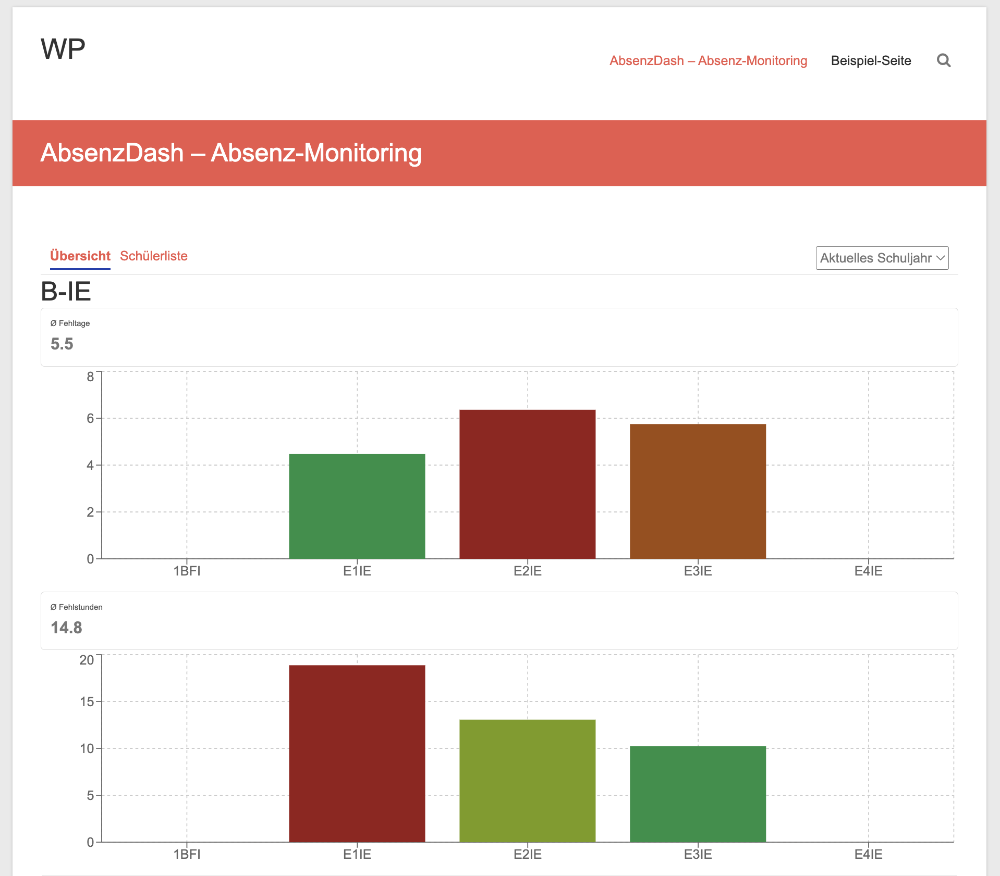
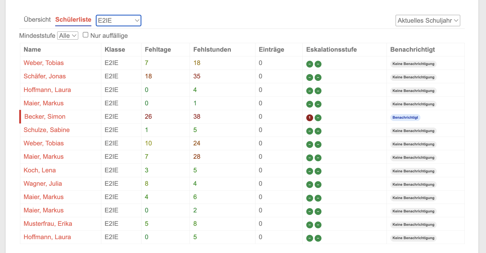
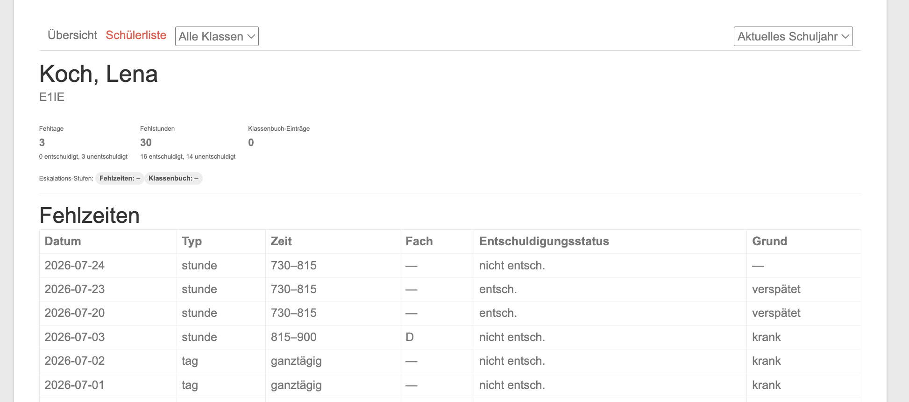

# AbsenzDash für Bereichsleitungen

Diese Anleitung richtet sich an Bereichsleitungen, die mehrere Klassenlehrkräfte bzw. deren Klassen unter sich haben. Für die grundlegende Bedienung (Schülerliste, Schüler-Detail, Maßnahmen, Ausnahmen) gilt alles aus der [Klassenlehrkraft-Anleitung](KL.md) entsprechend — diese Anleitung beschreibt vor allem, was sich als Bereichsleitung unterscheidet.

## Zugriff und Rechte

Sie sehen und bearbeiten **alle Klassen Ihres zugeordneten Bereichs** — nicht nur eine einzelne Klasse. Für jeden Schüler dieser Klassen haben Sie dieselben Bearbeitungsrechte wie eine Klassenlehrkraft: Maßnahmen erfassen, Ausnahmen setzen/aufheben.

Welche Klassen zu Ihrem Bereich gehören und dass Sie als Bereichsleitung eingetragen sind, wird zentral von der Schulleitung/Admin im WordPress-Backend gepflegt (Bereiche werden automatisch 1:1 aus den WebUntis-Abteilungen abgeleitet, siehe [SL.md](SL.md)). Fehlt eine Klasse in Ihrem Bereich oder sind Sie nicht als Bereichsleitung hinterlegt, wenden Sie sich an die Schulleitung — Sie können das nicht selbst ändern.

## Navigation

Wie bei der Klassenlehrkraft gibt es die Reiter **Übersicht** und **Schülerliste** (keinen "Admin"-Reiter — der ist der Schulleitung vorbehalten). Zusätzlich sehen Sie zwei Dropdowns in der Navigationsleiste:

- **Bereich-Dropdown** — bei mehreren zugeordneten Bereichen wählen Sie hier den gewünschten aus; bei genau einem Bereich ist er fest voreingestellt.
- **Klasse-Dropdown** — schränkt Übersicht/Schülerliste zusätzlich auf eine einzelne Klasse Ihres Bereichs ein.

Wie bei allen Rollen kann rechts oben zwischen aktuellem und vergangenem Schuljahr gewechselt werden (Historie-Modus, siehe [KL.md](KL.md)).

## Übersicht

Zeigt die durchschnittlichen Fehltage/Fehlstunden über alle Klassen Ihres Bereichs, je Klasse als eigener Balken, farblich codiert im Vergleich zu den anderen Klassen des Bereichs. Ein Klick auf einen Klassen-Balken springt in die Schülerliste dieser Klasse; ein Klick auf **Schülerliste** ohne vorherige Klassenwahl zeigt alle Schüler des gesamten Bereichs.

Klassen ohne aktive Schüler werden neutral grau dargestellt und fließen nicht in die Farbskala der übrigen Klassen ein.

## Schülerliste und Schüler-Detail

Funktional identisch zur Klassenlehrkraft-Ansicht (siehe [KL.md](KL.md), Abschnitte "Schülerliste" und "Schüler-Detail") — nur eben bereichsweit statt auf eine Klasse beschränkt. Über die Filter (Klasse-Dropdown, Mindeststufe, "Nur auffällige") behalten Sie auch bei mehreren Klassen den Überblick.

Bei Eskalationsstufen, die zusätzlich die Bereichsleitung als Empfänger vorsehen (z.B. ab Stufe 2), erhalten Sie automatisch eine E-Mail — unabhängig davon, ob Sie sich gerade im Dashboard befinden. Im Abschnitt "Benachrichtigungen" eines Schülers sehen Sie, an wen konkret versendet wurde.

## Klassendienste (Badges)

In der Schülerliste und im Schüler-Detail sehen Sie für alle Klassen Ihres Bereichs auch die aus WebUntis übernommenen **Klassendienste** (z. B. Entschuldigungs- oder Attestpflicht) als Kürzel-Badge hinter dem Namen, mit Hover-Text (Bezeichnung, Erklärung, „seit TT.MM.JJJJ“). Details und Bedeutung: [KL.md](KL.md), Abschnitt „Klassendienste (Badges)“. **Nur Anzeige:** keine Änderung in AbsenzDash möglich, kein Einfluss auf Zähler, Eskalation oder Benachrichtigungen.

## Worauf Sie als Bereichsleitung besonders achten sollten

Für Schulleitung und Bereichsleitung wird in der Übersicht zusätzlich hervorgehoben, wenn seit der letzten Benachrichtigung eines Schülers noch keine Maßnahme erfasst wurde — das sind Fälle, in denen eine Klassenlehrkraft ggf. an das Nachtragen einer Maßnahme erinnert werden sollte.

Der Hinweis zur **Ganztages-Fehlzeit-Erkennung** aus der Klassenlehrkraft-Anleitung (siehe [KL.md](KL.md)) gilt für alle Klassen Ihres Bereichs — geben Sie ihn bei Bedarf an Ihre Klassenlehrkräfte weiter.

## Kurz-FAQ

- **Mir fehlt eine Klasse im Bereich, oder ich sehe eine Klasse, die nicht mehr zu meinem Bereich gehört.** Bereiche werden automatisch aus den WebUntis-Abteilungen abgeleitet; melden Sie Abweichungen der Schulleitung/Admin.
- **Ich kann eine historische/leere Klasse nicht ausblenden.** Das Ausblenden von Bereichen aus Dashboard/Diagrammen erfolgt zentral im WordPress-Backend durch die Schulleitung/Admin, nicht durch die Bereichsleitung selbst.
- **Warum sehe ich keinen Admin-Bereich für Schwellwerte/Maßnahmen-Katalog?** Diese schulweite Konfiguration ist ausschließlich der Schulleitung vorbehalten (siehe [SL.md](SL.md)).
