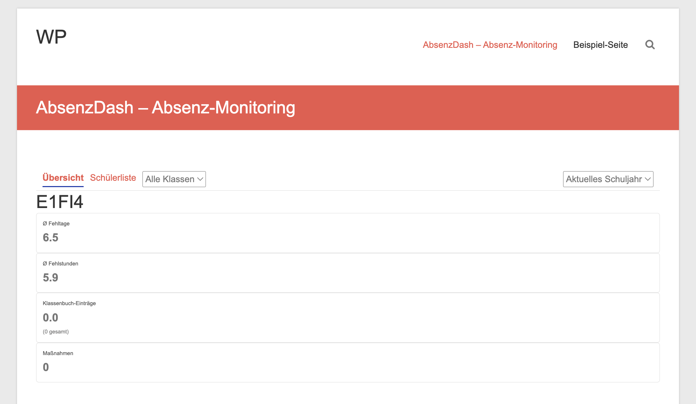
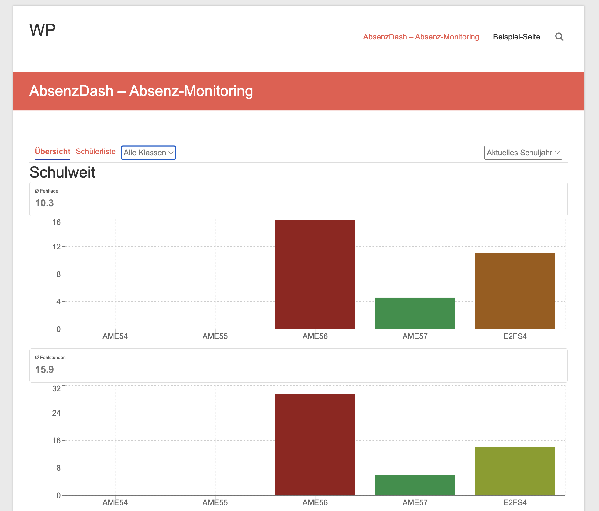
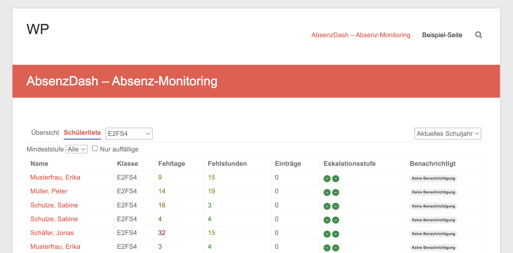
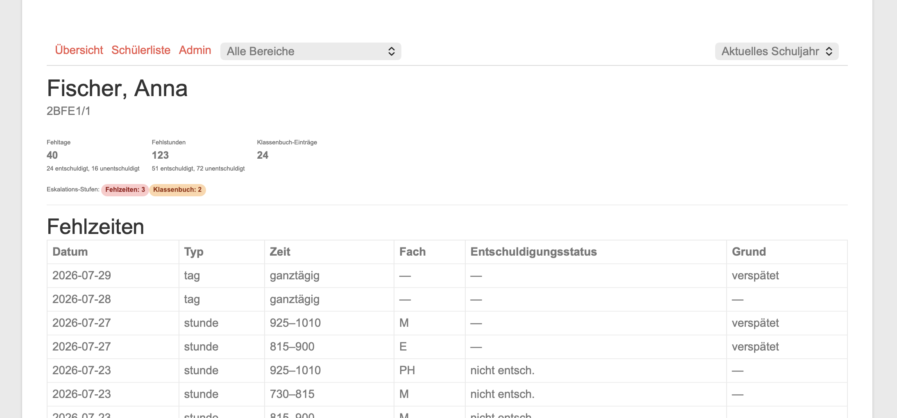
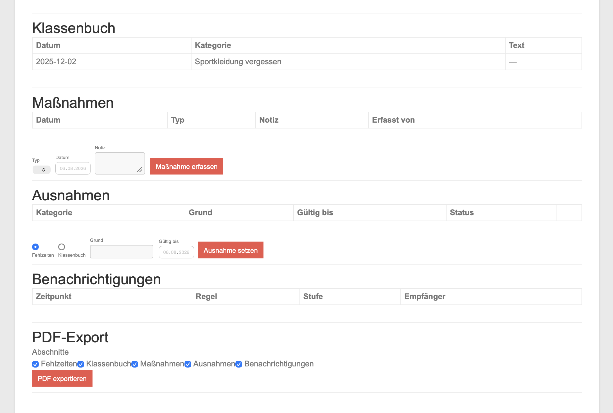

# AbsenzDash für Klassenlehrkräfte

Diese Anleitung richtet sich an Klassenlehrkräfte, die AbsenzDash über das WordPress-Frontend der Schule nutzen. Sie setzt voraus, dass Sie sich bereits mit dem üblichen WordPress-Login der Schule vertraut gemacht haben.

## Zugriff

AbsenzDash öffnet sich als eigenständiger Bereich innerhalb einer WordPress-Seite des Schulintranets (Link/Menüpunkt erfragen Sie bei Ihrer Schulleitung oder IT, falls Sie ihn nicht kennen). Ein separates Login ist nicht nötig — Sie sind automatisch angemeldet, sobald Sie im WordPress-Intranet eingeloggt sind.

Sie sehen als Klassenlehrkraft ausschließlich die Klasse(n), denen Sie laut WebUntis als Klassenlehrkraft (`teacher1`/`teacher2`) zugeordnet sind. Diese Zuordnung wird automatisch übernommen — Sie müssen dafür nichts einstellen. Fehlt eine Klasse oder ist die Zuordnung falsch, wenden Sie sich an Ihre Schulleitung/Admin (siehe [SL.md](SL.md)): eine zusätzliche Zuordnung (z.B. Vertretung, Co-Klassenlehrkraft) wird im WordPress-Backend gepflegt.

## Navigation

Oben finden Sie zwei Reiter:

- **Übersicht** — Kennzahlen-Dashboard Ihrer Klasse(n)
- **Schülerliste** — tabellarische Liste aller Schüler mit Status

Einen "Admin"-Reiter sehen Sie als Klassenlehrkraft nicht — die dortige Konfiguration (Schwellwerte, Maßnahmen-Katalog etc.) obliegt der Schulleitung.

Rechts oben können Sie zwischen dem aktuellen und vergangenen Schuljahren wechseln (**Aktuelles Schuljahr**-Dropdown). Ein vergangenes Schuljahr schaltet in einen reinen Nachschlage-Modus: Sie sehen dann rohe Zählungen für den gewählten Zeitraum statt der aktuellen Eskalationsstufen, und auch Schüler, die die Klasse inzwischen verlassen haben.

## Übersicht

Die Übersicht sieht unterschiedlich aus, je nachdem wie viele Klassen Sie als Klassenlehrkraft betreuen:

**Nur eine Klasse:** Sie sehen die Kennzahlen direkt als Zahlen (Ø Fehltage, Ø Fehlstunden, Klassenbuch-Einträge, Maßnahmen) — ein Balkendiagramm entfällt, da es bei einer einzelnen Klasse nichts zu vergleichen gibt.

**Mehrere Klassen:** Sie sehen zusätzlich ein Balkendiagramm mit einem Balken je Klasse (Ø Fehltage und Ø Fehlstunden), farblich codiert im Vergleich Ihrer Klassen untereinander. Ein Klick auf einen Balken springt direkt in die Schülerliste dieser Klasse.

## Schülerliste

Zeigt jeden Schüler Ihrer Klasse mit:

- **Fehltage / Fehlstunden** — Gesamtzahl im laufenden Schuljahr (farblich codiert; Tooltip/Hover zeigt die Aufteilung entschuldigt/unentschuldigt)
- **Einträge** — Anzahl Klassenbucheinträge
- **Eskalationsstufe** — zwei kleine farbige Kreise, einer für Fehlzeiten, einer für Klassenbuch. Ein Strich (–) bedeutet "keine Stufe erreicht", eine Zahl zeigt die aktuell erreichte Stufe.
- **Benachrichtigt** — ob wegen der aktuellen Stufe bereits eine E-Mail an Sie (und ggf. Bereichsleitung/Schulleitung) verschickt wurde

Mit **Mindeststufe** und **Nur auffällige** können Sie die Liste filtern, z.B. um nur Schüler zu sehen, die mindestens Stufe 1 erreicht haben. Klick auf einen Namen öffnet die Detailansicht.

## Schüler-Detail

Oben: Gesamtzahlen (Fehltage, Fehlstunden, Klassenbuch-Einträge, jeweils mit Entschuldigt/Unentschuldigt-Aufteilung) sowie die aktuellen Eskalationsstufen für Fehlzeiten und Klassenbuch.

Darunter, tabellarisch:

- **Fehlzeiten** — jede einzelne erfasste Fehlzeit mit Datum, Typ (Tag/Stunde), Uhrzeit, Fach, Entschuldigungsstatus und ggf. Grund
- **Klassenbuch** — Klassenbucheinträge (z.B. Verspätung, Verhaltenshinweis) mit Datum, Kategorie und Text

- **Maßnahmen** — bisher erfasste Maßnahmen (z.B. Gespräch, Elterngespräch, Nachsitzen) mit Datum, Typ, Notiz und erfassender Lehrkraft. Über das Formular darunter erfassen Sie eine neue Maßnahme: Typ auswählen, Datum, optional eine Notiz, dann **Maßnahme erfassen**. Manche Maßnahmen-Typen (in der Schule als "zurücksetzend" markiert, z.B. Nachsitzen) setzen dabei automatisch den Zählerstand für Fehlzeiten **und** Klassenbuch auf 0 zurück — die nächste Schwellwertstufe muss dann erst wieder neu erreicht werden.
- **Ausnahmen** — falls ein Schüler befristet oder dauerhaft von Benachrichtigungen ausgenommen werden soll (z.B. bei ärztlichem Attest), setzen Sie hier eine Ausnahme: Kategorie (Fehlzeiten oder Klassenbuch), Grund und optional ein Gültig-bis-Datum. Ohne Enddatum gilt die Ausnahme bis zur manuellen Aufhebung über den **Status**-Button in der Tabelle.
- **Benachrichtigungen** — Protokoll, wann welche Regel/Stufe eine E-Mail an wen ausgelöst hat. Steht dort "kein Empfänger ermittelbar", konnte für die erreichte Stufe niemand benachrichtigt werden (z.B. weil sich die zuständige Klassenlehrkraft noch nie im Dashboard angemeldet hat) — in diesem Fall lohnt sich ein Blick auf den Schüler auch ohne E-Mail.
- **PDF-Export** — erzeugt eine Druckansicht/PDF mit den gewählten Abschnitten (Checkboxen), z.B. für eine Meldung nach §90 oder ein Bußgeldverfahren.

## Wichtiger Hinweis: Ganztägiger Unterrichtsausfall wird nicht automatisch erkannt

Fällt an einem Tag durch Stundenausfall oder Entfall faktisch der restliche Schultag eines Schülers weg (Beispiel: ein Schüler hat vormittags einzelne erfasste Fehlstunden, danach entfallen die übrigen Stunden der Klasse ersatzlos), erkennt AbsenzDash das **nicht automatisch** als durchgehende Ganztages-Fehlzeit. Die dafür nötigen Stundenplan-/Entfall-Daten stehen AbsenzDash aus WebUntis nicht zur Verfügung.

**Empfehlung:** Halten Sie solche Fälle bewusst als einen zusammenhängenden Eintrag im WebUntis-Klassenbuch-Modul fest. Dieser wird über den regulären Sync korrekt in AbsenzDash übernommen und fließt so in die Zählung ein.

## Kurz-FAQ

- **Ich sehe eine falsche oder fehlende Klasse.** Die Zuordnung kommt aus WebUntis; eine zusätzliche manuelle Zuordnung (z.B. Vertretung) pflegt die Schulleitung/Admin im WordPress-Backend.
- **Ein Schüler hat trotz hoher Fehlzeiten Stufe "–".** Möglicherweise greift eine aktive Ausnahme, oder der Schwellenwert für die entsprechende Klassenstufe/Schulart liegt höher als schulweit üblich — beides sehen Sie nicht direkt in der Schülerliste, fragen Sie im Zweifel die Schulleitung.
- **Warum bekomme ich keine E-Mail, obwohl eine Stufe erreicht wurde?** Prüfen Sie den Abschnitt "Benachrichtigungen" im Schüler-Detail — dort steht, ob und an wen versendet wurde bzw. ob kein Empfänger ermittelbar war.
