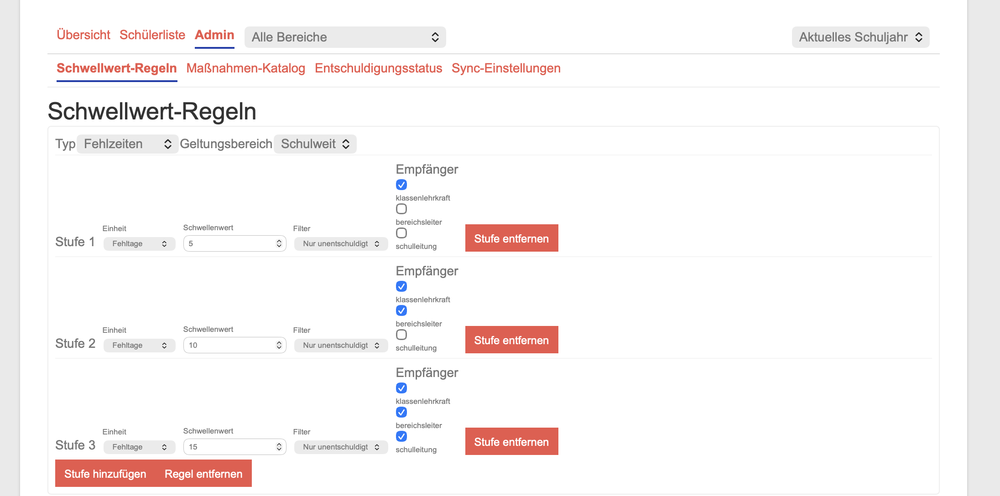
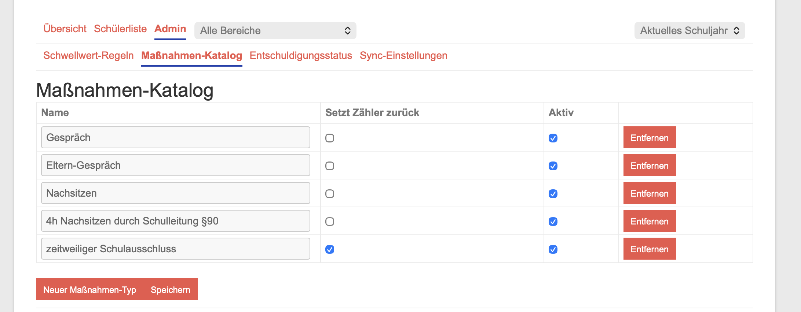
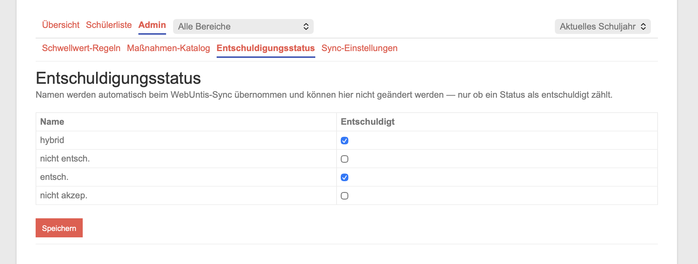
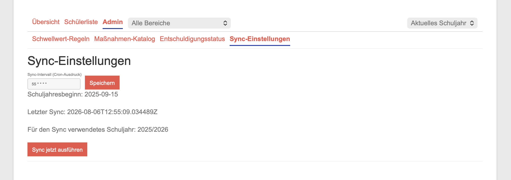
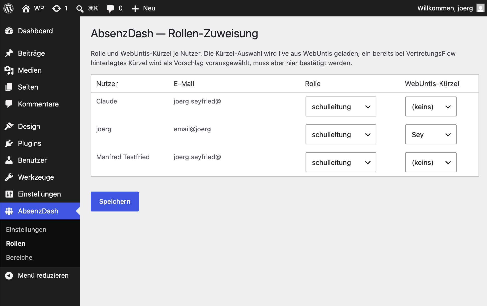
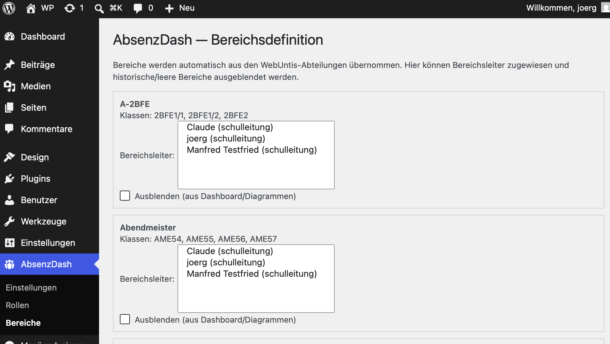

# AbsenzDash für die Schulleitung

Diese Anleitung richtet sich an die Schulleitung bzw. an Personen mit der Rolle "Schulleitung" in AbsenzDash. Sie haben Zugriff auf alle Klassen der Schule sowie auf die fachliche Konfiguration im Dashboard-Admin-Bereich; zusätzlich werden einige organisatorische Grundeinstellungen im WordPress-Backend gepflegt, mit dem Sie eventuell schon in anderer Funktion Kontakt hatten.

Für die grundlegende Bedienung von Übersicht, Schülerliste und Schüler-Detail (Maßnahmen erfassen, Ausnahmen setzen) gilt alles aus [KL.md](KL.md) und [BL.md](BL.md) entsprechend — Sie sehen dabei einfach **alle** Klassen der Schule statt nur einer Klasse oder eines Bereichs. Diese Anleitung konzentriert sich auf das, was ausschließlich der Schulleitung vorbehalten ist.

## Dashboard: schulweite Übersicht

Über das **Alle Bereiche**-Dropdown sehen Sie standardmäßig die durchschnittlichen Fehltage/Fehlstunden je Bereich; wählen Sie einen einzelnen Bereich aus, wechselt die Ansicht auf dessen Klassen (siehe [BL.md](BL.md)). Balken sind klickbar und führen direkt in die entsprechende Schüler- bzw. Klassenansicht.

## Admin-Bereich im Dashboard

Über den Reiter **Admin** (nur für die Rolle Schulleitung sichtbar) erreichen Sie vier Unterseiten:

### Schwellwert-Regeln

Getrennt konfigurierbar für **Fehlzeiten** und **Klassenbuch**. Eine Regel gilt entweder schulweit (Default/Fallback) oder für eine bestimmte Klassenstufe/Schulart — eine spezifische Regel bricht dabei für die betroffenen Schüler die schulweite Regel. Pro Klassenstufe/Schulart und Regel-Typ ist nur eine spezifische Regel gleichzeitig erlaubt; das System verhindert überlappende Regeln bereits bei der Eingabe.

Jede Regel hat mehrere Stufen (Stufe 1, 2, 3, …) mit steigenden Schwellenwerten. Je Stufe legen Sie fest:

- **Einheit** — Fehltage oder Fehlstunden (nur bei Fehlzeiten-Regeln)
- **Schwellenwert** — die Zahl, ab der die Stufe erreicht wird
- **Filter** — ob nur unentschuldigte oder alle (auch entschuldigte) Fehlzeiten/Einträge zählen
- **Empfänger** — die Klassenlehrkraft (bzw. bei Bereichsleiter-Klassen die Bereichsleitung) bekommt immer eine Benachrichtigung; zusätzlich können Sie Bereichsleitung und/oder Schulleitung ab dieser Stufe als weitere Empfänger hinzufügen (typisches Muster: Stufe 1 nur Klassenlehrkraft, Stufe 2 zusätzlich Bereichsleitung, Stufe 3 zusätzlich Schulleitung).

Der Zähler pro Schüler und Regel läuft ab Schuljahresbeginn bzw. ab dem letzten Reset durch eine zurücksetzende Maßnahme (siehe unten). Änderungen an einer Regel wirken erst ab dem nächsten Sync-Lauf — über **Sync jetzt ausführen** (siehe unten) können Sie das beschleunigen.

**Klassen ohne Regel:** Eine Klasse wird nur eskaliert, wenn für den Typ (Fehlzeiten bzw. Klassenbuch) eine Regel für sie gilt — eine Klassen-, Abteilungs- oder die schulweite Regel. Gibt es keine schulweite Regel und decken die Abteilungs-Regeln nicht alle Klassen ab (z.B. Regel nur für eine einzelne Abteilung), erscheint oben auf der Seite eine rote Warnung, z.B. „Für Fehlzeiten gibt es keine schulweite Regel; 12 Klassen haben keine Regel und werden nicht eskaliert." Schüler solcher Klassen (und Schüler mit aktiver Ausnahme) haben keine Eskalationsstufe: ein früher erreichter Stand wird beim nächsten Sync-Lauf auf „keine Stufe"/0 zurückgesetzt, es wird dabei keine Benachrichtigung versendet. Abhilfe: schulweite Regel anlegen oder weitere Abteilungs-Regeln ergänzen und danach **Sync jetzt ausführen**.

### Maßnahmen-Katalog

Hier pflegen Sie, welche Maßnahmen-Typen Klassenlehrkräften und Bereichsleitungen im Schüler-Detail zur Auswahl stehen (z.B. Gespräch, Elterngespräch, Nachsitzen, §90-Maßnahme, Bußgeld). Je Typ:

- **Setzt Zähler zurück** — ist dies aktiviert, setzt eine Erfassung dieser Maßnahme bei einem Schüler automatisch **beide** Zählerstände (Fehlzeiten und Klassenbuch) auf 0 zurück, unabhängig von einer bestimmten Regel oder Stufe.
- **Aktiv** — deaktivierte Typen bleiben in der Historie sichtbar, stehen aber bei neuen Erfassungen nicht mehr zur Auswahl.

Über **Neuer Maßnahmen-Typ** legen Sie einen weiteren Typ an, **Speichern** übernimmt alle Änderungen dieser Seite.

### Klassendienste

Hier legen Sie fest, welche WebUntis-Klassendienste (z. B. Entschuldigungspflicht, Pflicht zur Vorlage ärztl. Atteste) in AbsenzDash angezeigt werden. Je Dienst:

- **Dienst-ID** — stammt aus den WebUntis-Stammdaten Ihrer Schule. Am einfachsten über das Dropdown **Dienst aus WebUntis wählen** (füllt ID, Bezeichnung und einen Kürzel-Vorschlag vor); ist die Liste leer, zeigt die Seite einen Hinweis und Sie tragen den Dienst über **Dienst hinzufügen (manuell)** ein.
- **Kürzel** — erscheint als Badge in der Schülerliste (Vorschlag: erster Buchstabe, z. B. „E“, „A“; höchstens 10 Zeichen).
- **Erklärung** — optionaler Hover-Text zum Badge (höchstens 300 Zeichen).
- **Aktiv** — deaktivierte Dienste werden weder importiert noch angezeigt, bleiben aber gespeichert.

**Entfernen** löscht den Dienst beim Speichern samt aller importierten Zuordnungen (die Seite fragt vorher nach); wollen Sie ihn nur ausblenden, schalten Sie stattdessen **Aktiv** ab. **Nur Anzeige:** Die Dienste haben keinen Einfluss auf Zähler, Eskalation oder Benachrichtigungen. Der Import läuft höchstens einmal täglich; neue Einstellungen wirken daher mit dem nächsten Tagesimport. Technische Hinweise (interner WebUntis-Dienst, nicht zuordenbare Schüler im Log): [ADMIN.md](ADMIN.md). Die Badges selbst sind in [KL.md](KL.md) erklärt.

### Entschuldigungsstatus

Die Namen der Entschuldigungsstatus (z.B. "entsch.", "nicht entsch.") kommen automatisch aus WebUntis und können hier **nicht** umbenannt werden. Sie legen nur fest, ob ein Status als "entschuldigt" zählt — das entscheidet, ob eine Fehlzeit in die "Nur unentschuldigt"-Filterung der Schwellwert-Regeln einfließt. Neu aus WebUntis übernommene, bisher unbekannte Status werden automatisch mit "nicht entschuldigt" ergänzt und tauchen dann hier zur Bestätigung/Korrektur auf.

### Sync-Einstellungen

- **Sync-Intervall (Cron-Ausdruck)** — legt fest, wie oft AbsenzDash Fehlzeiten und Klassenbucheinträge aus WebUntis abruft und die Schwellwerte prüft. Eine Änderung wird sofort für neu geplante Läufe wirksam.
- **Schuljahresbeginn** und **für den Sync verwendetes Schuljahr** — werden automatisch aus WebUntis übernommen und sind rein informativ, hier nicht editierbar.
- **Letzter Sync** — Zeitpunkt des letzten Laufs, zur groben Kontrolle, dass der Sync regelmäßig läuft.
- **Sync jetzt ausführen** — stößt einen einzelnen Sync-Lauf sofort an, z.B. damit eine gerade geänderte Schwellwert-Regel nicht erst auf den nächsten geplanten Lauf warten muss. Dieser manuelle Lauf kann je nach Datenmenge einige Minuten dauern.

Technische Aspekte des Syncs (WebUntis-Zugangsdaten, ASV-BW-CSV-Datei, Retry-Verhalten bei Ausfällen) liegen im Verantwortungsbereich der IT — siehe [ADMIN.md](ADMIN.md).

## WordPress-Backend: organisatorische Grundeinstellungen

Zusätzlich zum Dashboard-Admin-Bereich werden zwei Dinge im **WordPress-Backend** gepflegt (Menüpunkt **AbsenzDash** in der WP-Seitenleiste) — dort, wo auch sonst Nutzer und Rollen der Schulintranet-Seite verwaltet werden:

### Rollen-Zuweisung

Unter **AbsenzDash → Rollen** legen Sie je WordPress-Nutzer die AbsenzDash-Rolle (Klassenlehrkraft/Bereichsleiter/Schulleitung) sowie das zugehörige WebUntis-Kürzel fest. Die Kürzel-Auswahl wird live aus WebUntis geladen; ist eine Person bereits im Schwesterprojekt VertretungsFlow mit einem Kürzel hinterlegt, wird dieses als Vorschlag vorausgewählt — bitte trotzdem bestätigen. Ohne zugewiesene Rolle kann sich eine Person nicht im Dashboard anmelden.

Die eigentliche **Klassenlehrkraft-Zuordnung je Klasse** kommt automatisch aus WebUntis (`teacher1`/`teacher2`) und muss hier nicht manuell gepflegt werden; eine manuelle Zusatzzuordnung (z.B. Vertretung) wird bewusst nicht angeboten.

### Bereichsdefinition

Unter **AbsenzDash → Bereiche** sehen Sie je Bereich die zugehörigen Klassen (read-only, automatisch 1:1 aus den WebUntis-Abteilungen übernommen) und können:

- die **Bereichsleitung** zuweisen (Mehrfachauswahl möglich),
- den Bereich über **Ausblenden (aus Dashboard/Diagrammen)** aus den Übersichten entfernen, ohne dabei Daten zu löschen — sinnvoll für historische oder aktuell leere Bereiche (z.B. ohne aktive Schüler), die sonst die Farbskala der Diagramme verzerren würden.

Name und Klassenzusammensetzung eines Bereichs sind nicht editierbar, da sie direkt aus WebUntis stammen.

## Abgrenzung zur IT-Administration

Backend-URL, Shared Secret, Server-/Docker-Betrieb, WebUntis-Zugangsdaten, SMTP-Konfiguration und die ASV-BW-CSV-Datenquelle sind technische Einstellungen, die von der IT vorgenommen werden — siehe [ADMIN.md](ADMIN.md). Als Schulleitung müssen Sie sich damit im Regelfall nicht befassen.

## Datenschutz

Die im Dashboard sichtbaren Auswertungen (Fehlzeiten, Klassenbuch, Maßnahmen) bestehen fachlich bereits, z.B. manuell in WebUntis, und sind zur Erfüllung des Erziehungs- und Bildungsauftrags erforderlich. AbsenzDash automatisiert diese Auswertung lediglich. Die Einführung der automatisierten Verarbeitung sollte dennoch als organisatorischer Schritt in das Verfahrensverzeichnis der Schule (Art. 30 DSGVO) aufgenommen werden — das ist kein technischer Schritt, sondern liegt in der Verantwortung der Schulleitung.

## Kurz-FAQ

- **Eine Klassenlehrkraft/Bereichsleitung kann sich nicht anmelden.** Prüfen Sie zuerst **AbsenzDash → Rollen** im WP-Backend — ohne zugewiesene Rolle ist kein Zugriff möglich.
- **Ein neuer Bereich fehlt, oder ein Bereich enthält falsche Klassen.** Bereiche werden automatisch aus WebUntis-Abteilungen abgeleitet; das übernimmt der nächste WebUntis-Sync automatisch, sobald die Abteilung dort korrekt gepflegt ist.
- **Eine geänderte Schwellwert-Regel soll sofort wirken.** Nutzen Sie **Sync jetzt ausführen** auf der Sync-Einstellungen-Seite.
